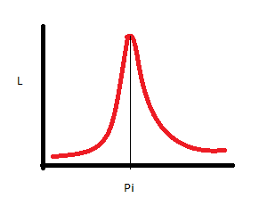

---
output:
  pdf_document:
    latex_engine: xelatex
    highlight: pygments
mainfont: Calibri Light
sansfont: Calibri Light
fontsize: 11pt
geometry: margin=1in
---

**Homework 01**  
**Joseph Blubaugh**  
jblubau1@tamu.edu  
**STAT 659-700**  

\newpage

1.2) 

c) ordinal 

e) nominal 

f) ordinal

\rule{\textwidth}{.2pt}

1.3.  

a) $Y \mathtt{\sim} Binom(n = 100, \pi = .25)$  

b) $P(Y > y) = 1 - pbinom(50, 100, .25) = 0$

\rule{\textwidth}{.2pt}

1.4)

a) $(H,H) = .25$,  $(H,T) = .5$,  $(T,T) = .25$,  $E(\pi) = .5$,  $SD(\pi) = \sqrt{.5(1 - .5)/2} = .353$  

b) For $\pi = .60$:  $(H,H) = .36$,  $(H,T) = 2(.60(1 - .60)) = .48$,  $(T,T) = (1 - .60)^2 = .16$  
For $\pi = .40$:  $(H,H) = .16$, $(H,T) = 2(.40(1 - .40)) = .48$,  $(T,T) = (1 - .40)^2 = .36$

c)  Liklihood Function: $L(\pi) = {2 \choose 1} \pi^1 (1 - \pi)^{2 - 1}$

 

d)  
$$\frac{dL(\pi)}{d \pi} = \frac{d}{d \pi} \Bigg [ log{2 \choose 1} + log(\pi) + log(1 - \pi) \Bigg ] = \frac{1}{\pi} - \frac{1}{1 - \pi} = 0$$
$$\frac{1}{\pi} = \frac{1}{1 - \pi} \Longrightarrow 1 = \frac{\pi}{1 - \pi}$$
$$\pi = \frac{1}{1 + 1} = .5$$

\rule{\textwidth}{.2pt}

\newpage

1.8)

a) $314 / 1170 = .294$

b) $$H_0: \pi > .5, H_a: \pi \le .5$$
$$Z = \frac{.294 - .5}{\sqrt{.5(1 - .5)/1170}} = -14.02$$
$$P(Z \le 14.02) = 1$$ There is no evidence to support that the true proportion of the population who would answer yes is greater than .5

c) $$SE(\pi) = \sqrt{.5 (1 - .5) / 1170} = .0146$$
$$\textup{99 Percent Confidence Interval} = .294 \pm 2.575 (.0146) = (.256, .331)$$

\rule{\textwidth}{.2pt}

1.9)

a) $$H_0: \pi - \pi_0 = 0,  H_a: \pi - \pi_0 \ne 0$$
$$Z = \frac{.6 - .4}{\sqrt{\frac{.4 (1 - .4)}{100}}} = 4.082$$
$$\textup{Pvalue} = 2 P(Z \ge 4.082) = 0$$

b) 95% Confidence intervals for the proptions of responses who said the new drug was better
$$\textup{Wald} = .6 \pm 1.96 \sqrt{.6 (1 - .6) / 100} = (.504, .696)$$
$$\textup{Wilson} = \frac{.6 + \frac{1.96^2}{200} \pm 1.96 \sqrt{\frac{.6(1 - .6)}{100} + \frac{1.96^2}{4(100^2)}}}{1 + (1.96^2 / 100)} = (.502, .690)$$
$$\textup{Agresti-Coull} = .596 \pm 1.96 \sqrt{.596 (1 - .596) / 104} = (.502, .690)$$
$$\textup{Clopper-Pearson} = ([1 + \frac{100 - 60 + 1}{60 F_{120, 82}(.975)}]^{-1}], [1 + \frac{100 - 60 + 1}{60 F_{120, 82}(.025)}]^{-1}] = (.497, .687)$$
All of the Confidence Intervals are very similar. The Agresti-Coull and Wilson confidence intervals are the same because N is large and are more precise than the Wald estimator. The Clopper-Pearson interval actual probably coverage is larger than 95% so the interval is wider than neccesary.
  
\rule{\textwidth}{.2pt}

\newpage

1.10)
\begin{align*}
  .08 =& 1.96 \sqrt{.75 (1 - .75) / n} \\
  .08^2 =& 1.96^2 (.1875 / n) \\
  .0064 =& .7203 / n \\
  n =& .7203 / .0064 = 112.5 \\
  n \mathtt{\sim}& 113 \\
\end{align*}

1.12)

a) You would not be able to calculate the statistic because you would be dividing by 0
b) Since the standard error is 0 there would be no interval, the lower and upper bounds would be equal at 0.
c) $(0 - .5) / \sqrt{(.5 (1 - .5) / 25)} = -.5$, pvalue $= 2*pnorm(-5) = 0$
d) $\frac{0 + \frac{1.96^2}{2(25)} \pm 1.96 \sqrt{0 + \frac{1.96^2}{4(25^2)}}}{1 + (1.96^2 / 25)} = (0, .133)$

\rule{\textwidth}{.2pt}

1.14)

a) i) $.044 + .010 + .001 = .055$, ii) $.945$

b) i) $.033$, ii) $.967$

c) Because the binomial distribution is a discrete distribution and the sample size is small, exact probability cannot be obtained and so an average is created which inflates alpha. The mid pvalue corrects for this and is less conservative as a result.

1.19) The Wilson and Agresti-Coull CI are virtually the same, the Wald is wider than both. Clopper-Pearson is significantly wider at the lower bound of the CI.

```{r a, comment=NA}

y = 8; n = 13; pi = y/n; pi.star = (y + 2)/(n + 4); n.star = n + 4

Wald = pi + c(-1, 1) * 1.96 * sqrt(pi * (1 - pi) / n)
Wilson = (pi + (1.96^2 / (2*n)) + c(-1, 1) * 1.96 * 
            sqrt( (pi * (1 - pi)) / n + (1.96^2) / (4 * n^2))) / (1 + (1.96^2 / n))
Agresti.Coull = pi.star + c(-1, 1) * 1.96 * sqrt(pi.star * (1 - pi.star) / n.star)
Clopper.Pearson = c((1 + (n - y + 1)/(y * qf(p = .025, 2 * (y + 1), 2 * (n - y))))^(-1), 
                    (1 + (n - y + 1)/(y * qf(p = .975, 2 * (y + 1), 2 * (n - y))))^(-1))

data.frame(Wald, Wilson, Agresti.Coull, Clopper.Pearson, row.names = c("Lower", "Upper"))

```

\rule{\textwidth}{.2pt}

\newpage

1.15)

a) Using the 2nd derivative of the moment generating function gets us the variance of the binomial

$$M(t) = [(1 - p) + pe^t]^n$$
$$M'(t) = n[1 - p + pe^t]^{n - 1} (pe^t)$$
$$M''(t) = n[1 - p + pe^t]^{n - 1} (pe^t) + (pe^t)n(n - 1)[1 - p + pe^t]^{n - 2} (pe^t)$$
$$M''(0) = np(1 - p)$$
$$sd = \sqrt(p (1 - p)/n)$$

b) There is less probability in the tails so a more precise estimate can be achieved.

\rule{\textwidth}{.2pt}

1.18)
\begin{align*}
  \pi_0 = .5, & n = 10 \\
  \\
  1.96 =& (p - .5) / \sqrt{.5(1 - .5)/n} \\
       =& (p - .5) / .5 / \sqrt{n} \\
       =& \sqrt{n} (p - .5) / .5 \\
   .98 =& \sqrt{n} (p - .5) \\
     p =& .8 \\
  \\
  0 =& (1 + 1.96^2/10) .5^2 + (-2(.8)) - 1.96^2/10) .5 + .8^2 \\
  \\
  \textup{95 Pct CI}: & .8 \pm 1.96 \sqrt{.8(1 - .8)/10} \\
  & = (.55, 1) \\
\end{align*}


