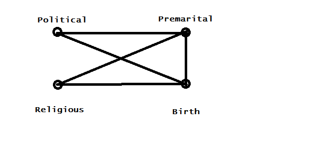
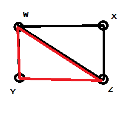
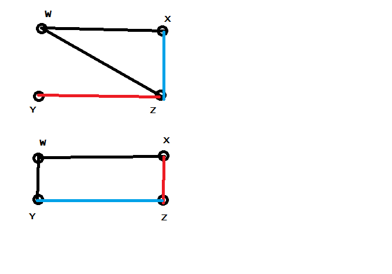
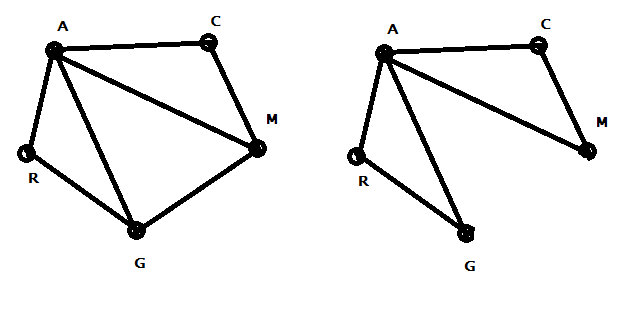

---
output:
  pdf_document:
    latex_engine: xelatex
    highlight: pygments
mainfont: Calibri Light
sansfont: Calibri Light
fontsize: 10pt
geometry: margin=1in
---

**Homework 10**  
**Joseph Blubaugh**  
jblubau1@tamu.edu  
**STAT 659-700**  


### 7.3

```{r a1, echo=FALSE, comment=NA, message=FALSE, warning=FALSE}
dta = data.frame(
  President = c(rep(1, 4), rep(2, 4)),
  Busing = rep(c(1, 1, 2, 2), 2),
  Home = c(1, 2, 1, 2, 1, 2 , 1, 2),
  Count = c(41, 65, 72, 175, 2, 9, 4, 55)
)
mdl = glm(Count ~ .*., family = poisson, data = dta)
summary(mdl)
```

a) $G^2 = 408.04 - .479 = 407.561 > 12.59 = qchisq(.95, 6)$ Conclude that there is significant evidence that the model fits the data well.
b) President:Housing `OR: exp(.7211) = 2.05`  
President:Home `OR: exp(1.55) = 4.71`   
Busing:Home `OR: exp(.4672) = 1.59`  
c) $Ho: BP = 0, Ha: BP > 0, 95CI: .7211 + c(-1,1) * 1.96*(.3539) = (.027, 1.414)$ Reject $H_o$
d) exp(.027, 1.414) = (1.027, 4.11), The odds of someone supporting busing and a black president are 1.02 to 4.11 times more than someone not supporting busing and a black president.

\newpage

### 7.4

```{r b1, echo=FALSE, comment=NA, message=FALSE, warning=FALSE}
dta = data.frame(
  Gender = c(rep("Male", 4), rep("Female", 4)),
  Info= rep(c(rep("Support", 2), rep("Oppose", 2)), 2),
  Health = rep(c("Support", "Oppose"), 4),
  Count = c(76, 160, 6, 25, 114, 181, 11, 48)
)

mdl = glm(Count ~ .*., family = poisson, data = dta)
summary(mdl)
```

a) $G^2 = 445.8 - .3 = 445.5 > 12.59 = qchisq(.95, 6)$ Conclude that there is significant evidence that the model fits the data well
b) The conditional odds that a Male Supports the Health opinion is exp(.4636) = 1.58 times that of a Female Opposing the Health opinion.
c) Based on an $\alpha = .04$, the pvalue of GI is greater than .05 so we would conclude that there is no conditional dependence between Gender and Info and the interaction term is not needed in the model.

\newpage

### 7.6

```{r c1, echo=FALSE, comment=NA, message=FALSE, warning=FALSE}

dta = data.frame(
  EI = c("E", "E", "E", "E", "E", "E", "E", "E", 
         "I", "I", "I", "I", "I", "I", "I", "I"),
  SN = c("S", "S", "S", "S", "N", "N", "N", "N", 
         "S", "S", "S", "S", "N", "N", "N", "N"),
  JP = c("J", "J", "P", "P", "J", "J", "P", "P", 
         "J", "J", "P", "P", "J", "J", "P", "P"),
  TF = c("T", "F", "T", "F", "T", "F", "T", "F", 
         "T", "F", "T", "F", "T", "F", "T", "F"),
  Count = c(77, 106, 42, 79, 23, 31, 18, 80, 140, 
            138, 52, 106, 13, 31, 35, 79)
)

(mdl = glm(Count ~ ., family = poisson, data = dta))
```

a) $G^2 = 399.94 - 135.87 = 264.07 > 9.48 = qchisq(.95, 4)$ Conclude that there is significant evidence that the model fits the data well

```{r c2, echo=FALSE, comment=NA, message=FALSE, warning=FALSE}
options(width = 100)
mdl = glm(Count ~ .*., family = poisson, data = dta)
summary(mdl)
```

b) Based on the interaction variable with the largest absolute coefficient, SN:JP has the strongest association

c) Both EI/JP and EI/TF have coefficients near 0 and they both are statistically insignificant so there is not strong evidence of an assocation.

\newpage

### 7.7

a) $G^2 = 12.36 - 10.16 = 2.2 < 5.99 = qchisq(.95, 2)$ Conclude that there is no significant difference between the two models.
b) $OR: (exp(-1.5075), exp(-.9382)) = (.2214, .3913)$
c) The odds of SJ is exp(1.22) = 3.387 times that of NP

### 7.8

a) Mutual Independence: $log(\mu_{ijkl}) = \lambda + \lambda_i^{EI} + \lambda_j^{SN} + \lambda_k^{JP} + \lambda_l^{TF}$  
Homogeneous Association: $log(\mu_{ijkl}) = \lambda + \lambda_i^{EI} + \lambda_j^{SN} + \lambda_k^{JP} + \lambda_l^{TF} + \lambda_{ij}^{EI:SN} + \lambda_{ik}^{EI:JP} + \lambda_{il}^{EI:TF} + \lambda_{jk}^{SN:JP} + \lambda_{jl}^{SN:TF} + \lambda_{kl}^{JP:TF}$  
Saturated Model: $log(\mu_{ijkl}) = \lambda + \lambda_i^{EI} + \lambda_j^{SN} + \lambda_k^{JP} + \lambda_l^{TF} + \lambda_{ij}^{EI:SN} + \lambda_{ik}^{EI:JP} + \lambda_{il}^{EI:TF} + \lambda_{jk}^{SN:JP} + \lambda_{jl}^{SN:TF} + \lambda_{kl}^{JP:TF} + \lambda_{ijk}^{EI:SN:JP} + \lambda_{ijl}^{EI:SN:TF} + \lambda_{ikl}^{EI:JP:TF} + \lambda_{jkl}^{SN:JP:TF}$


b) Mutual Independence: 238.7  
Homogeneous Association: 125  
Saturated Model: 129.9

The Homogenous Association model would be the best model because it has the lowest AIC. This makes sense because the saturated model with the 3way interaction terms are all insignificant.

```{r c3, echo=FALSE, comment=NA, message=FALSE, warning=FALSE}
(mdl = glm(Count ~ .^3, family = poisson, data = dta))
```

\newpage

### 7.9

```{r d1, echo=FALSE, comment=NA, message=FALSE, warning=FALSE}
dta = data.frame(
  Department = rep(1:6, 4),
  Admitted = rep(c(rep("Yes", 6), rep("No", 6)), 2),
  Gender = c(rep("Male", 12), rep("Female", 12)),
  Count = c(512, 353, 10, 138, 53, 22, 313, 207, 205, 279, 138, 
            351, 89, 17, 202, 131, 94, 24, 19, 8, 391, 244, 299,
            317)
  )
dta$Department = factor(dta$Department)
mdl1 = glm(Count ~ .*., family = poisson, data = dta)
summary(mdl1)
 
```

a) $OR: exp(-.029)$
b) $G^2 = 2917.15 - 75.06 = 2842 > 28.8 = qchisq(.95, 18)$ Based on the Likelihood ratio test and the marginal model plot, I would conclude that the model is a reasonable fit to the data. One cause for concern is the Residual Deviance/DF is high

\newpage

```{r d2, echo=FALSE, comment=NA, message=FALSE, warning=FALSE, fig.height=4}
library(car)
mmps(mdl1)

dta = subset(dta, Department != 1)

mdl2 = glm(Count ~ .*., family = poisson, data = dta)
summary(mdl2)

mmps(mdl2)
```

c) $G^2 = 2135.45 - 69.713 = 2065 > 24.9 = qchisq(.95, 15)$ Since the models are not using the same dataset we cannot compare AIC, but the 2nd model shows every factor level is significant compared to one that was not significant in the first model. The likelihood ratio test and marginal model plots help us to conclude that the model fits the data well. 

```{r d3, echo=FALSE, comment=NA, message=FALSE, warning=FALSE, fig.height=4}
mdl = glm(Admitted ~ Department*Gender, weights = Count, family = binomial, data = dta)
summary(mdl)
```

d) Conditional on Department 2: OR = exp(-.22) = .80  
Conditional on Department 3: OR = exp(-.22 - 2.1399) = .094  
Conditional on Department 4: OR = exp(-.22 + .138) = .921  
Conditional on Department 5: OR = exp(-.22 + .4202) = 1.22  
Conditional on Department 6: OR = exp(-.22 + .031) = .827

\newpage

### 7.10

```{r e1, echo=FALSE, comment=NA, message=FALSE, warning=FALSE, fig.height=4}
dta = data.frame(
  Safety = c(rep("Seat Belt", 4), rep("None", 4)),
  Ejected = rep(c("Yes", "Yes", "No", "No"), 2),
  Injury = rep(c("Non Fatal", "Fatal"), 4),
  Count = c(1105, 14, 411111, 483, 4624, 497, 157342, 1008)
)
mdl = glm(Count ~ .*., family = poisson, data = dta)
summary(mdl)
mmps(mdl)
```

a) The odds of an injury for someone wearing a seatbelt who was ejected is exp(-.756 -.727 - 2.399) = .02 times that of a person not wearing a seatbelt and was not ejected.  
The odds of injury for someone wearing a seatbelt enduring a nonfatal injury is exp(-.756 + 5.043 + 1.717) = 405 times that of someone who is not wearing a seatbelt and endures a fatal injury.  
The odds of an injury for someone who is ejected and nonfatally injured is exp(-.727 + 5.043 - 2.797) = 4.56 times that of someone who was non ejected and endured a fatal injury.  

```{r e2, echo=FALSE, comment=NA, message=FALSE, warning=FALSE, fig.height=4}
mdl = glm(Injury ~ Safety*Ejected, weights = Count, family = binomial, data = dta)
summary(mdl)

```

b) The odds of a non fatal injury from someone who is wearing a seatbelt is exp(1.69) = 5.41 times that of someone who is not wearing a seatbelt  
The odds of a non fatal injury from someone who is ejected is exp(-2.82) = .0596 times that of someone who is not ejected  
The odds of a non fatal injury from someone who was ejected while wearing a seatbelt is exp(1.69 - 2.82 + .441) = .5 times that of someone who is not ejected while not wearing a seatbelt

c) `with(dta, 1/(2*576184) * sum(abs(Count - mean(Count)))) = .736`

\newpage

### 7.14

a)

```{r e3, echo=FALSE, comment=NA, message=FALSE, warning=FALSE, fig.height=4}
dta = data.frame(
  political = factor(c(1, 1, 1, 1, 1, 1, 1, 1, 2, 2, 2, 2, 2, 2, 2, 2, 3, 3, 3, 3, 3, 3, 3, 3)),
  premarital = factor(c(1, 1, 1, 1, 2, 2, 2, 2, 1, 1, 1, 1, 2, 2, 2, 2, 1, 1, 1, 1, 2, 2, 2, 2)),
  religious = factor(c(1, 1, 2, 2, 1, 1, 2, 2, 1, 1, 2, 2, 1, 1, 2, 2, 1, 1, 2, 2, 1, 1, 2, 2)),
  birth = factor(c(1, 2, 1, 2, 1, 2, 1, 2, 1, 2, 1, 2, 1, 2, 1, 2, 1, 2, 1, 2, 1, 2, 1, 2)),
  count = c(99, 15, 73, 25, 8, 4, 24, 22, 73, 20, 87, 37, 20, 13, 50, 60, 51, 19, 51, 36, 6, 12, 33, 88)
)
mdl = glm(count ~ .*., family = poisson, data = dta)
summary(mdl)
```

b) 
Political(Moderate):Premarital(Wrong): The odds of a moderate who thinks premarital sex is wrong is exp(.7199) = 2.054 times that of a liberal who thinks premarital sex is okay  

Political(Conservative):Premarital(Wrong): The odds of a conservative who thinks premarital sex is wrong is exp(.8018) = 2.3 times that of a liberal who thinks premarital sex is okay  

Political(Moderate):Religous(frequent): The odds of political moderate who attends church frequently is exp(.258) = 1.29 times that of liberal who attends church infrequently  

Political(Conservative):Religous(frequent): The odds of conservative who attends church frequently is exp(.344) = 1.41 times that of a liberal who attends church infrequently  

Political(Moderate):BirthControl(disagree): The odds of moderate disagreeing with birth control is exp(.3048) = 1.356 times that of liberal who agrees with birth control  

Political(Conservative):BirthControl(disagree): The odds of conservative who disagrees with birth control is exp(.9288) = 2.53 times that of a liberal who aggrees with birth control  

Premarital(Wrong):Religous(frequent): The odds of someone who thinks premarital sex is wrong and attends church frequently is exp(1.145) = 3.14 times that of a person who thinks premarital sex is okay and attends church infrequently  

Premarital(Wrong):BirthControl(disagree): The odds of someone who thinks premarital sex is wrong and disagrees with birth control is exp(1.146) = 3.14 times that of someone who thinks premarital sex is okay and agrees with birth control

Relgious(frequent):BirthControl(disagree): The odds of someone who attends church frequently and disagrees with birth control is exp(.597) times that of someone who attends church infrequently and agrees with birth control    

```{r e4, echo=FALSE, comment=NA, message=FALSE, warning=FALSE, fig.height=4}
mdl.logistic = glm(premarital ~ political + religious + birth, weights = count, 
                   family = binomial, data = dta)
mdl.loglinear = glm(count ~ .*., 
                   family = poisson, data = dta)

summary(mdl.logistic); summary(mdl.loglinear)


```

c)  The odds of a moderate aggreeing that premarital sex is wrong is exp(.728) = 2.07 times that of a liberal  
The odds of a conservative aggreeing that premarital sex is wrong is exp(.805) = 2.23 times that of a liberal  
The odds of a frequent church goer agreeing that premarital sex is wrong is exp(1.14) = 3.12 that of an infrequent church goer  
The odds of a someone against birth control agrreeing that premarital sex is wrong is exp(1.1487) = 3.15 times that of who supports birth control  

d) Only religious and political are independent  


  
\newpage

### 7.16

a)

```{r f1, echo=FALSE, comment=NA, message=FALSE, warning=FALSE, fig.height=4}

dta = data.frame(
  Gender = c(rep("Female", 8), rep("Male", 8)),
  Location = rep(c(rep("Urban", 4), rep("Rural", 4)), 2),
  Seatbelt = rep(c("No", "No", "Yes", "Yes"), 4),
  Injury = rep(c("No", "Yes"), 8),
  Count = c(7287, 996, 11587, 759, 3246, 973, 6134, 757, 10381, 812, 10969,
            380, 6123, 1084, 6693, 513)
)

mdl = glm(Count ~ .^3, family = poisson, data = dta)
summary(mdl)

```


### 7.19

a) Variables x and y are conditionally indepenent

b) X and Y are not directly related, but are partially related through by W and Z

### 7.20
Both X and Y are independent in both cases
  

### 7.22

a) M is not connected to R, but both A and M are connected to G.  

b) GR only connection to CM is through A  
  

c) Because the linkage between A, C, M to G, R all go through A.

### 7.24

a) There are some high leverage, high residual points that are heavily influencing the model, but the residuals look random the overall the model appears to be a good fit.
 
```{r g1, echo=FALSE, comment=NA, message=FALSE, warning=FALSE, fig.height=4}
dta = data.frame(
  Religion.Attend = c(rep("Never", 4),
                      rep("Less Than Once a Year", 4),
                      rep("Once or Twice a Year", 4),
                      rep("Several Times a Year", 4),
                      rep("About Once a Month", 4),
                      rep("2-3 Times per Year", 4),
                      rep("Nearly Every Week", 4),
                      rep("Every Week", 4),
                      rep("Several Times a Week", 4)),
  Teenage.BC = rep(c("Strongly Agree", "Agree", "Disagree", "Strongly Disagree")),
  Count = c(49, 49, 19, 9, 31, 27, 11, 11, 46, 55, 25, 8, 34, 37, 19, 7,
            21, 22, 14, 16, 26, 36, 16, 16, 8, 16, 15, 11, 32, 65, 57, 61,
            4, 17, 16, 20)
)
dta$Religion.Attend = relevel(dta$Religion.Attend, ref = "Never")
dta$Teenage.BC = relevel(dta$Teenage.BC, ref = "Strongly Agree")

mdl = glm(Count ~ Religion.Attend + Teenage.BC, family = poisson, data = dta)
summary(mdl)
mmps(mdl)

```

b) There is a strong association between Religious Attendance and supporting teenage birth control. The odds of someone supporting teen birth control increases by exp(0.004) = 1.004 for each increased level of religeous attendance. The result is insiginicant.

```{r g2, echo=FALSE, comment=NA, message=FALSE, warning=FALSE, fig.height=4}
Rscore = as.numeric(dta$Religion.Attend)
Cscore = as.numeric(dta$Teenage.BC)
mdl = glm(Count ~ Religion.Attend + Teenage.BC + I(Rscore*Cscore), 
          family = poisson, data = dta)
summary(mdl)
mmps(mdl)
```

c) $G^2 = 360.16 - 107.6 = 252.56 > 21 = qchisq(.95, 12)$

d) The fit seemed to improve slightly, but the results are not very different

```{r g3, echo=FALSE, comment=NA, message=FALSE, warning=FALSE, fig.height=4}
Rscore = as.numeric(dta$Religion.Attend)
Cscore = rep(c(1,2,4,5), 9)
mdl = glm(Count ~ Religion.Attend + Teenage.BC + I(Rscore*Cscore), 
          family = poisson, data = dta)
summary(mdl)
mmps(mdl)
```

e) Agree and Disagree have opposite effects in terms of their association with Religious attendance. The relationship of someone who supports birth control increases the liklihood that they go to church more often.

### Additional I

Model 2 is the best model with the lowest deviance and 1 degree of freedom.

```{r g4, echo=FALSE, comment=NA, message=FALSE, warning=FALSE, fig.height=4}
dta = data.frame(
  gender = c("male", "male", "male", "male", "female", "female", "female", "female"),
  country = c("American", "American", "British", "British", "American", 
              "American", "British", "British"),
  switch = c("y", "n", "y", "n", "y", "n", "y", "n"),
  count = c(29, 6, 19,  15, 7, 23, 24, 29)
)

mdl1 = glm(count ~ ., family = poisson, data = dta)
mdl2 = glm(count ~ .*., family = poisson, data = dta)
mdl3 = glm(count ~ .^3, family = poisson, data = dta)

anova(mdl1, mdl2, mdl3, test = "Chisq")
```

### Additional II

a and b)   

c)   

### 7.25

a) 

b) You can test the Wald Z value for significane, if the $Ho: \beta = 0$ is not rejected then X and Y are independent

c) $\beta$ is a linear combination of the ordered factors so the relationship is fixed for the different levels.

d) This is equivalent to setting an interaction term which is equivalent to homogenous association


### 7.26

